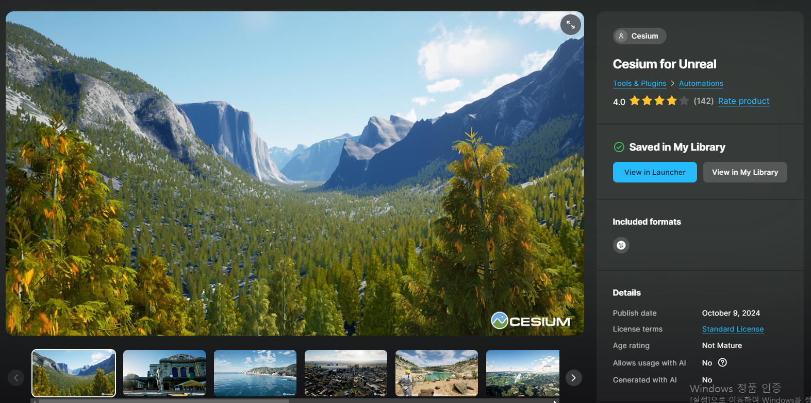

# CESIUM 플러그인
CESIUM은 3D 지리 공간 데이터를 사용하는 소프트웨어 애플리케이션을 개발하기 위한 오픈 플랫폼입니다.

# 언리얼 엔진에서 CESIUM 켜는법
## 1. Epic Games Launcher Fab에서 CESIUM 설치
먼저 Epic Games Launcher 의 Fab에서 Cesium for Unreal을 찾아 라이브러리에 추가합니다.  
  
팹의 위치는 Epic Games Launcher -> 언리얼 엔진에서 확인 하실 수 있고 *지금 확인하기*를 클릭하여 들어가면 원하는 플러그인이나 맵을 라이브러리로 가져올 수 있습니다.  
  
다음을 라이브러리로 가져와 확인해줍니다.  
   
Epic Games Launcher로 돌아와 라이브러리를 확인해주면 다음과 같이 Cesium for Unreal이 존재하는 것을 확인할 수 있습니다. 그 후 엔진에 설치를 누르면 현재 본인이 설치되어 있는 엔진에 맞게 설치되는 것을 확인할 수 있습니다.  
(AccuCities...은 개인적으로 설치한 것이기에 보지 않으셔도 됩니다.)  

## 2. 언리얼 엔진 에디터에서 플러그인 적용  
  
다음과 같이 편집 -> 플러그인을 선택하여서 CESIUM을 적용시킬 수 있습니다.  
  
다음은 cesium을 검색하여 플러그인을 적용한 모습입니다.  

**기본적인 CESIUM 사용법이 궁금하다면 (https://cesium.com/learn/unreal/unreal-quickstart/) 이 곳으로 가서 확인해 볼 수 있습니다.**