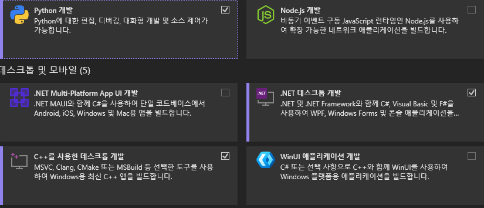
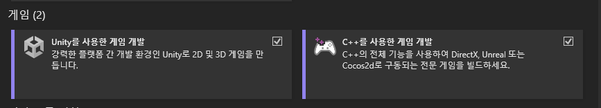
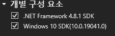

**현재 AirSim을 찾아보며 배우는 입장으로 잘못된 부분이 있을 수 있습니다.**

# AirSim 설명  
AirSim은 마이크로소프트 사에서 개발한 오픈소스 프로젝트로 자율주행 및 자율비행 소프트웨어 개발에 도움을 주고 있습니다.  
AirSim은 Unreal Engine을 기반으로 하며 차량이나 드론의 상태와 관련된 API를 제공합니다.  
(<https://github.com/microsoft/AirSim/tree/main/docs>)  

# Window에서의 AirSim 설치  
## Unreal Engine 설치  
1. [Epic Games Launcher](https://www.unrealengine.com/download)를 다운로드 받습니다.  
2. Epic Games Launcher를 실행하고 라이브러리로 가서 4.27.2 버전의 언리얼 엔진을 다운로드 받습니다.  
   화면 상의 +버튼을 누르고 버전을 선택하여 다운받을 수 있습니다.  
     

## Visual Studio 2022 설치  
[Visual Studio 2022](https://visualstudio.microsoft.com/ko/vs/)를 다운로드 받습니다. 이때 C++를 사용한 데스크톱 개발 / .NET 데스크톱 개발 / C++를 사용한 개임 개발 / 개별 요소에서 최신 .NET Framework SDK와 Windows 10 SDK 10.0.19041을 선택하여 설치합니다.  
  
  
  

## CMAKE
AirSim 빌드를 하기 위해서는 CMAKE를 설치할 필요가 있습니다.  
[CMAKE](https://cmake.org/download/)에 들어가 Binary disitributions에서 운영체제에 맞게 설치해줍니다. 저는 3.31.6과 4.0.0을 둘 다 다운 받아서 사용해봤는데 오류인지 4.0.0에서는 처음에는 되었다가 재설치 했을때는 안되기도 하고 그래서 지금은 3.31.6을 사용 중에 있습니다.

## Developer Command Prompt for VS 2022
1. `Developer Command Prompt for VS 2022`를 실행합니다. 이는 Visual Studio 설치 시 자동 설치되기에 Window 검색창을 이용하여 실행 가능합니다.  
2. 이제 원하는 폴더 위치에서 AirSim git을 clone해줍니다. `git clone https://github.com/Microsoft/AirSim.git` 그 후 `cd AirSim`을 이용하여 AirSim 폴더로 이동해줍니다.  
3. `build.cmd` 명령어를 입력하여 플러그인을 생성하면 AirSim을 사용가능한 상태가 됩니다. 이때 AirSim 폴더로 가는 경로 상에 한국어가 있다면 오류가 발생할 확률이 굉장히 높습니다. 
ex) C:\Users\공부\AirSim - 중간에 있는 공부라는 폴더로 인해 AirSim경로를 찾아가지 못해서 오류가 발생할 가능성이 높음

## Unreal Engine 실행
이제 Unreal Engine을 실행하여 AirSim\Unreal\Environments\Blocks 다음 경로를 따라 Blocks 폴더에 있는 .uproject가 성공적으로 열린다면 오류 없이 AirSim 설치를 완료한 것 입니다. 
