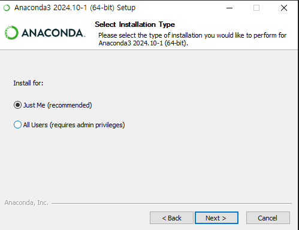
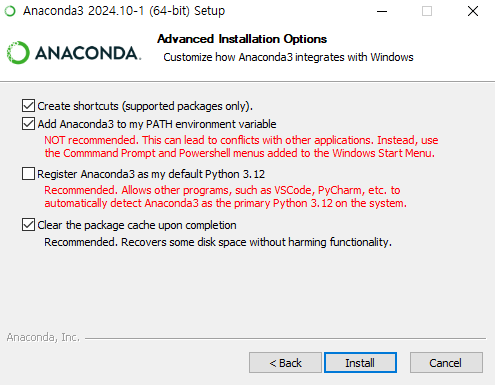
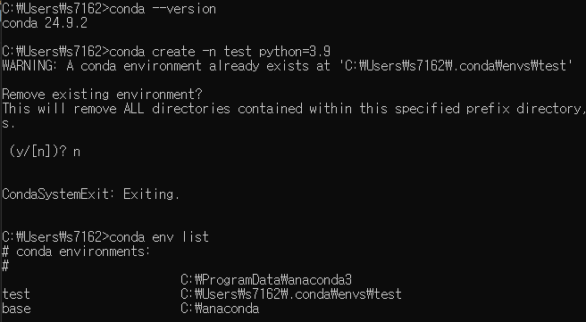
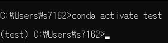

**에어심 파이썬 스크립트 사용 전 라이브러리 설치**
**필요 시 더 많은 라이브러리 설치 가능성도 존재**

# 1. Anaconda
가상 환경 설정, Jupyter 환경, 다양한 파이썬 패키지/라이브러리(pandas, numpy, matplotlib) 등을 사용할 수 있게 해주는 Anaconda를 설치해줍니다.  
설치 방법은 https://www.anaconda.com/download#Downloads 다음 url로 들어가서 가장 최신 버전을 다운로드 받으면 된다. 이메일을 입력하라고 나오는데 입력 란 밑의 Skip registration을 클릭해서 넘어가서 받을 수 있습니다.  
이때 파이썬 버전은 필자는 3.9.10을 사용 중입니다.  
  
  
위의 선택 사항들은 shortcut을 만들건지, anaconda3를 Path에 추가할 것인지, python 3.12를 기본 파이썬으로 할 것인지, 캐쉬를 깔끔하게 할 것인지를 선택하는건데 필자는 3.9.10을 사용하기에 위처럼 선택사항을 선택하고 넘어갔습니다.  

  
이제 cmd 창에서 conda --version을 이용하여 Anaconda가 잘 깔려있음을 확인할 수 있습니다.  
conda create -n test python=3.9를 cmd 창에 입력하여 가상 환경을 세팅할 수 있는데 이때 test는 본인이 원하는 가상 환경의 이름이고 저는 이미 만들어져 있기에 삭제하고 다시 깔 것이냐고 물어보는 것입니다.  
conda env list를 이용하여 자신이 만든 가상 환경을 확인할 수 있습니다.  

  
가상 환경에 돌입한 모습으로 conda activate (본인 가상 환경 이름)으로 특정 가상 환경에 진입 가능합니다.  
이제 에어심 파이썬 라이브러리를 설치해주겠습니다.  
pip install msgpack-rpc-python  
pip install airsim  
pip install opencv-python  
을 cmd창에 작성하여 받아줍니다 이때 airsim이 numpy가 없다면서 안될 수 있는데 이때는 pip install numpy를 한 후에 받아주면 정상적으로 작동될 것입니다.  

이제 이를 테스트 해보기 위해 AirSim -> PythonClient -> car로 이동합니다. (cmd창에서 cd를 이용하여 이동합니다.)  
이제 언리얼 에디터에서 Blocks 에디터를 열고 플레이를 누른 후 cmd 창에서 python hello_car.py를 입력하고 에디터를 확인해보면 차가 자동으로 움직이는 것을 확인할 수 있습니다.  